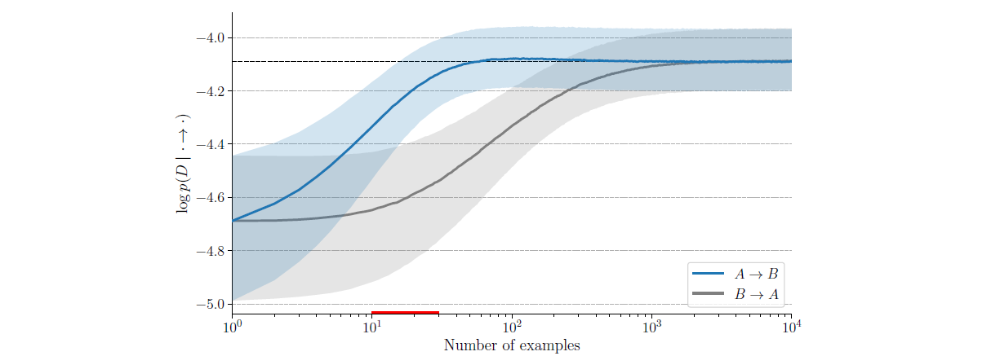

Some my personal understandings of *Prof. Yoshua Bengio's* ICLR 2020 paper: [A Meta-Transfer Objective for Learning to Disentangle Causal Mechanisms](https://openreview.net/pdf?id=ryxWIgBFPS).

### Correlation-Based Machine Learning

Machine learning technologies are based on the concept of correlation modeling. The most basic way to modeling the correlation between two random variables $X$ and $Y$ could be the Pearson correlation coefficient $\rho_{X,Y}$, which is defined as the devision of covariance and standard deviation products:
$$
\begin{align}
& \rho_{X,Y}=\frac{cov(X,Y)}{\sigma_{X}\sigma_{Y}}=\frac{E[(X-\mu_{X})(Y-\mu_{Y})]}{\sigma_{X}\sigma_{Y}}
\end{align}
$$
Such a coefficient is symmetrical for $X$ and $Y$ and does not indicate any "causations". It is widely accepted that correlation does not imply causation, for example, we can claim that the temperatures and the numerical readings from thermometers are strongly correlated, however, we could only state that the thermometer readings are caused by temperatures while an inversed statement is unreasonable.

It is claimed that machine learning models and algorithms are merely based on correlation modeling. For example, we let random variables $X$ and $Y$ denote the altitude of a geographical location, and its annually average temperature respectively. Given a dataset $D=\lbrace{(x_i,y_i)\rbrace}_{i=1}^{N}$ drawn from $X$ and $Y$, we are actually able to build machine learning models $f(\cdot\rightarrow\cdot \mid \theta)$ in both directions (where the dot represents either $X$ or $Y$), training the models on $D$ and obtaining excellent prediction accuracy. However, in principle, only altitude affects temperatures, while the temperature has no chance to alter inherent geographical features.

It is not the reason that we are *not willing to* build a stronger model, which is able to infer the causal relations between objects, but the fact that we are *not capable of*. That is, learning causal relations only based on a tuple dataset $D=\lbrace{(x_i,y_i)\rbrace}_{i=1}^{N}$ is technically impossible. The root cause of such a situation is actually originated from *information loss​* during the data collection procedure. We can imagine that such a dataset is collected by dedicated workers, who *first* climb to geographical locations with different locations, and *then* measures the temperature using a thermometer. However, when marking down each record of data into tuples $(x_i,y_i)$, such an observation order, which implies important information of causality, is regrettably discarded.

In a statistical point of view, each set of real-world natural phenomena (modeled by random variables $X_1$, $X_2$, $\cdots$, $X_N$) occur in a certain causal order that governed by physical laws. If we want to analyze these phenomena by machine learning approaches, collecting data in the format of $x_1, x_2, \cdots, x_N$ will degenerate a causality-aware conditional distribution product into a causality-free joint distribution. We still take the two-variable problem ($X$: altitude, $Y$: temperature) as the simplest case. Such a distribution degeneration process could be formulated as:
$$
p(X)\cdot p(Y\mid X)\xrightarrow{degenerate} p(X,Y)
$$
The information loss results in the fact that we can model both $p(X)\cdot p(Y\mid X)$ and $p(Y)\cdot p(X\mid Y)$ using dataset $D$ and machine learning algorithms, but not able to find out which one is causally reasonable.

### Factorization and Meta-Learning

Our objective is to enable a intelligent learner the ability to learn "how to learn", that is, the learner is supposed to be able to "choose" a causally reasonable model from all possible factorizations of the joint distribution $p(X,Y)$. In the simplest two-variable setting, the model can only select two possible factorizations of $p(X,Y)$, which could be formulated by the following *meta-parameter* $c$.
$$
\begin{align}c=\left\{\begin{split}&1 ,  ~~~select~~p(X)\cdot p(Y\mid X) \\&0 ,  ~~~select~~p(Y)\cdot p(X\mid Y) \\\end{split}\right.\end{align}
$$
Specifically, if $c=1$, the learner tends to believe "altitude causes temperature" and will build models to learn "altitude distribution" $p(X)$ and "how altitude will affect temperature" $p(Y\mid X)$; if $c=0$, the learner tends to believe "temperature causes altitude" and will build models to learn "temperature distribution" $p(Y)$ and "how temperature will affect altitude" $p(X\mid Y)$. Clearly that $c=1$ is in line with physical laws.

We expect to design an algorithm for the learner to learn the parameter $c$ dynamically during optimizations on the conditional probabilities. It is easy to discover that our problem is similar to a meta-learning problem, where we can design an inner loop for parameter optimization that simultaneously provides useful information for an outer loop meta-parameter iteration. We then come into Bengio's idea on the solution of this problem and the additional data needed.

### Idea: by Discriminating Adaptation Speed

#### Intervention

Intervention is an essential concept in the literatures of *Causal Inference*, which focuses on conducting a distribution shift on a certain variable and measures the outcome of other variables. We are not going to introduce this basic concept in details, instead, we simply consider changing the "cause" distribution from $p(X)$ to $p^1(X)$, which is like we change the altitude data from Asia to America. In this case, the joint distribution of altitude-temperature data is shifted to:
$$
p^1(X,Y)=p^1(X)\cdot p(Y\mid X)
$$
where the physical process of "how altitudes affect temperatures" $p(Y\mid X)$ remains unchanged. We could sample a new dataset $D_1=\lbrace{(x_i,y_i)\rbrace}_{i=1}^{N_1}$ from distribution $p^1(X,Y)$ that we call it "transfer dataset". And here comes Bengio's idea: ***After both models are well-trained on the original dataset $D$, the model with correct causality is supposed to <u>converge more quickly</u> on transfer dataset $D_1$***.  

#### Justification: Knowledge with correct modular structure is easier to transfer.

Such an idea is a little bit unacceptable at the first glance, thus I try to explain the justification of the idea in my own understandings. It is well-accepted that knowledge itself has modular and disentangled structures. Still taking the altitude-temperature relation as an example, we can learn the knowledge of temperature distribution by separately learning the knowledge of altitude distribution of a region and the knowledge of physical laws on how altitudes could affect temperatures. In this case, the knowledge are correctly modularized and structured into two independent parts. 

If the "cause" distribution $p(X)$ is shifted to $p_1(X)$, a well-trained model with correct knowledge structure only need to re-learn the knowledge about the new region's altitude distribution $p_1(X)$. On the contrary, the learned distribution (knowledge) $p(Y\mid X)$ is still valid and only requires minor modification. This is because $p(Y\mid X)$ is in line with the physical laws that generate data in nature. However, although well-fitted on the original dataset, a model with a wrong knowledge structure will have to re-learn both $p(Y)$ and $p(X\mid Y)$, resulting to a much slower adaptation speed. Because the distribution of "how temperature affects altitude" $p(X\mid Y)$ has no physical meanings and it is merely a "curve-fitting" on original dataset $D$. 

Somebody may suggest to do an intervention on the marginal temperature distribution $p(Y)$, and in this case, the $p(Y)\cdot p(X\mid Y)$ modularization method will adapt faster. However, the fact is that doing an intervention on the temperature distribution $p(Y)$ will result to nothing, not even tiny changes on the joint distribution $p(X,Y)$, because changing the temperature would never lead to changes of inherent geographical features of a region according to real-world physical laws.

#### Illustration: Toy Examples

We instantiate the random variables $X$ and $Y$ to provide a more specified illustration. Without loss of generality, we assume both $X$ and $Y$ are categorical random variables, where both of them possess $M$ possible values, that is $X\in\lbrace  x_i\rbrace_{i=1}^{M}$ and $Y\in\lbrace  y_i\rbrace_{i=1}^{M}$. In this case, we can parameterize $p(X)$ and $p(Y)$ using two parameter vectors $\mathbb{\theta}_X,\theta_Y\in\mathbb{R}^{M}$. Then the probability table of $X$ and $Y$ could be formulated by
$$
\begin{align}\begin{split}&p(X=x_i)=softmax(\theta_X)_{[i]} \\&p(Y=y_i)=softmax(\theta_Y)_{[i]} \\\end{split}\end{align}
$$
For the conditional distributions, we use parameter matrices $\Theta_{Y\mid X}$ and $\Theta_{X\mid Y}$ in $\mathbb{R}^{M\times M}$to characterize $p(Y\mid X)$ and $p(X\mid Y)$ respectively, where the conditional probabilities is derived by
$$
\begin{align}\begin{split}&p(Y=y_j\mid X=x_i)=SoftmaxIn Row(\Theta_{Y\mid X})_{[i][j]} \\&p(X=x_j\mid Y=y_i)=SoftmaxInRow(\Theta_{X\mid Y})_{[i][j]} \\\end{split}\end{align}
$$
In total, we need $M$ parameters to parameterize each $X$ or $Y$ , while for each $X\mid Y$ or $Y\mid X$ we need $M^2$. Without loss of generality, we suppose that the causal relation is $X\rightarrow Y$ and we have the "ground-truth" distribution $p^0(X)$ and $p^0(Y\mid X)$ (parameterized by $\theta^0_X$ and $\Theta^0(Y\mid X)$) to generate "original dataset" $D=\lbrace(x_i,y_i)\rbrace_{i=1}^{N}$. As discussed above, we conduct an "intervention" to make $p^0(X)\rightarrow p^1(X)$, and we sample another "transfer dataset" $D_1=\lbrace(x_j,y_j)\rbrace_{j=1}^{N_1}$ from $p^1(X)\cdot p^0(Y\mid X)$.

If the two models $\lbrace\theta_{X},\Theta_{Y\mid X}\rbrace$ and $\lbrace\theta_{Y},\Theta_{X\mid Y}\rbrace$ have already been well trained on $D$, one can believe that $\lbrace\theta_{X},\Theta_{Y\mid X}\rbrace$ would adapt more quickly on transfer dataset $D_1$. This is because when the distribution intervention on $p^0\rightarrow p^1$ occurs, the correct model $X\rightarrow Y$ has already learned a valid representation of $p(Y\mid X)$ and store such a part of knowledge into parameters $\Theta_{Y\mid X}$. Therefore, we only need to re-optimize $\theta_X$ (with $O(M)$ parameters) to fit the new $p^1(X)$. However, if the model does not get a correct factorization from the beginning, the learned parameters $\theta_Y,\Theta_{X\mid Y}$ could only serve as the result of "curve-fitting" on the original dataset, and both of them (with $O(N^2)$ parameters) will require re-optimization in the transfer learning procedure. The authors also conduct an empirical study on the average log-likelihood with the number of training examples $N_1$ on the transfer dataset, in which we can see that a model with factorization that is in line with ground-truth data generation process will converge much more quickly. (Note that in this figure $A$ represents the "cause", while $B$ represents the "effect.)

### A Meta-Transfer Objective

We then discuss how to employ adaptation speed discrepancies as training information.

***Summary what we have:*** 

+ Original dataset $D=\lbrace(x_i,y_i)\rbrace_{i=1}^{N}$ , sampled from $p^0(X)\cdot p^0(Y\mid X)$
+ Transfer dataset $D_1=\lbrace(x_j,y_j)\rbrace_{j=1}^{N_1}$, sampled from $p^1(X)\cdot p^0(Y\mid X)$
+ Models (yet trained) with opposite causal relations: $\lbrace\theta_{X},\Theta_{Y\mid X}\rbrace$ and $\lbrace\theta_{Y},\Theta_{X\mid Y}\rbrace$
+ Meta-parameter $c$ (yet optimized)

***Our target is:***

+ Let the learner find the appropriate $c$ according to the adaptation speed of different models.

#### Smooth Parameterization of the Causal Structure

According to $(3)$, the meta-parameter $c$, which indicates the causal structure that the learner selects, is a $0-1$ variable. Such a discrete setting makes $c$ difficult to optimize by gradient descent. We consider a smooth parameterization of $c$, where we set the probability of choosing $X\rightarrow Y$ ($c=1$) as
$$
p(c=1)=sigmoid(\gamma)
$$
Then we have $p(c=0)=1-sigmoid(\gamma)$, where $\gamma\in \mathbb{R}$ is a continuous trainable parameter.

 

